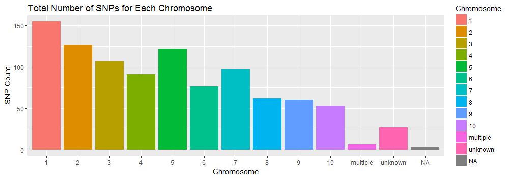
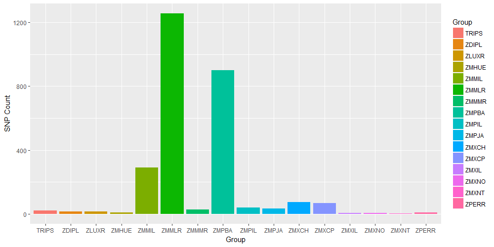
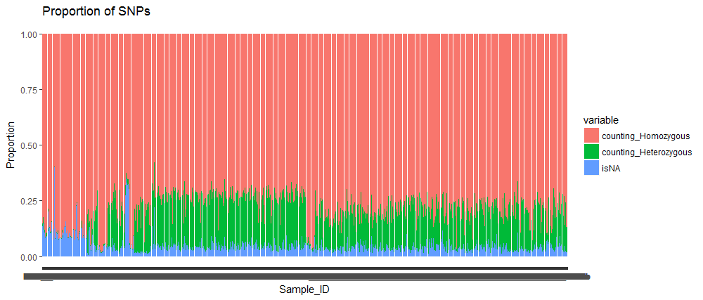
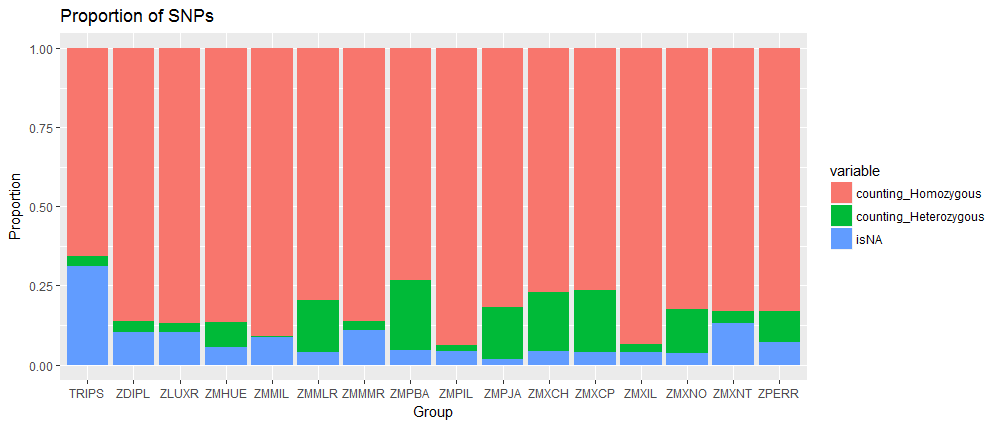
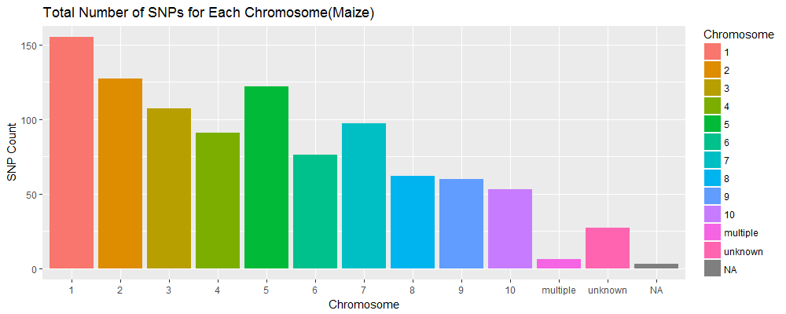

#Part I

###*Data inspection*

**1. Load data files into R**

```{r}
Genotypes <- read.table("fang_et_al_genotypes.txt", header = TRUE, sep = "\t", stringsAsFactors = FALSE)
SNPposition <- read.table("snp_position.txt", header = TRUE, fill = TRUE, sep = "\t", stringsAsFactors = FALSE)
```
**2. Using R commands to perform data inspection**

For one example and the results R return:
```{r}
> typeof(Genotypes)
[1] "list"
> typeof(SNPposition)
[1] "list"
> class(Genotypes)
[1] "data.frame"
> class(SNPposition)
[1] "data.frame"
> ncol(Genotypes)
[1] 986
> ncol(SNPposition)
[1] 15
> nrow(Genotypes)
[1] 2782
> nrow(SNPposition)
[1] 983
> dim(Genotypes)
[1] 2782  986
> dim(SNPposition)
[1] 983  15
> file.size("fang_et_al_genotypes.txt")
[1] 11054722
> file.size("snp_position.txt")
[1] 83747
```

Also try other commands:
```{r}
file.info("fang_et_al_genotypes.txt")
file.info("snp_position.txt")
str(Genotypes)
str(SNPposition)
colnames(Genotypes)
colnames(SNPposition)
rownames(Genotypes)
rownames(SNPposition)
head(Genotypes)
head(SNPposition)
```
###*Data processing*
**1. Extract data from the *Genotype* dataframe to make two objects:**
<br />(1) *Maize* (ZMMIL, ZMMLR, and ZMMMR)
<br />(2) *Teosinte* (ZMPBA, ZMPIL, and ZMPJA)

```{r}
Maize <- c("ZMMIL", "ZMMLR", "ZMMMR")
Teosinte <- c("ZMPBA", "ZMPIL", "ZMPJA")
MaizeGenotypes <- Genotypes[Genotypes$Group %in% Maize, ]
TeosinteGenotypes <- Genotypes[Genotypes$Group %in% Teosinte, ]
```

**2. Clean the useless columns in *MaizeGenotypes* and *TeosinteGenotypes* dataframes to get the names of the SNPs and the data.**

```{r}
MaizeGenotypes_cut <- MaizeGenotypes[,-1:-3]
TeosinteGenotypes_cut <- TeosinteGenotypes[,-1:-3]
```

**3. Clean the useless columns in *SNPposition* dataframe.**

```{r}
SNPposition_cut <- SNPposition[, c("SNP_ID","Chromosome","Position")]
```

**4. Transpose the *MaizeGenotypes_cut* and *TeosinteGenotypes_cut* dataframes.**

```{r}
MaizeGenotypes_transposed <- as.data.frame(t(MaizeGenotypes_cut))
TeosinteGenotypes_transposed <- as.data.frame(t(TeosinteGenotypes_cut))
```
**5. Make sure the two transposed files are dataframes.**

```{r}
> is.data.frame(MaizeGenotypes_transposed)
[1] TRUE
> is.data.frame(TeosinteGenotypes_transposed)
[1] TRUE
```
**6. Create a new *SNP_ID* column and delete the rownames created in the transposed files.**

```{r}
SNPsMaizeGenotypes_transposed <- cbind(SNP_ID = rownames(MaizeGenotypes_transposed), MaizeGenotypes_transposed)
rownames(SNPsMaizeGenotypes_transposed) <- NULL

SNPsTeosinteGenotypes_transposed <- cbind(SNP_ID = rownames(TeosinteGenotypes_transposed), TeosinteGenotypes_transposed)
rownames(SNPsTeosinteGenotypes_transposed) <- NULL
```

**7. Sort the *SNPposition_cut*, *SNPsMaizeGenotypes_transposed*, and *SNPsTeosinteGenotypes_transposed*.**

```{r}
SNPposition_sorted <- SNPposition_cut[order(SNPposition_cut$SNP_ID),] #sort by SNP_ID
Maize_sorted <- SNPsMaizeGenotypes_transposed[order(SNPsMaizeGenotypes_transposed$SNP_ID),] #sort by SNP_ID
Teosinte_sorted <- SNPsTeosinteGenotypes_transposed[order(SNPsTeosinteGenotypes_transposed$SNP_ID),] #sort by SNP_ID
```

**8. Check the rows in the files are all line up.**

```{r}
> table(SNPposition_sorted$SNP_ID %in% Maize_sorted$SNP_ID)

TRUE 
 983 
> table(SNPposition_sorted$SNP_ID %in% Teosinte_sorted$SNP_ID)

TRUE 
 983 
```
**9. Join the *SNPposition_sorted* dataframe to *Maize_sorted* and *Teosinte_sorted* by SNP_ID.**

```{r}
Maize_joined <- merge(SNPposition_sorted, Maize_sorted, by.x="SNP_ID", by.y="SNP_ID")
Teosinte_joined <- merge(SNPposition_sorted, Teosinte_sorted, by.x="SNP_ID", by.y="SNP_ID")
```
**10. Order the dataset based on increasing position values and with missing data encoded by symbol ?**

```{r}
library(gtools)

MaizeIncrease_ordered <- Maize_joined[mixedorder(Maize_joined$Position),] 
TeosinteIncrease_ordered <- Teosinte_joined[mixedorder(Teosinte_joined$Position),]
```
```{r}
MaizeChr1 <- MaizeIncrease_ordered[MaizeIncrease_ordered$Chromosome == 1,]
write.table(MaizeChr1, "MaizeChr1.txt", sep="\t", row.names = FALSE) 
```
(Repeat for each chromosome.)
```{r}
TeosinteChr1 <- TeosinteIncrease_ordered[TeosinteIncrease_ordered$Chromosome == 1,]
write.table(TeosinteChr1, "TeosinteChr1.txt", sep="\t", row.names = FALSE)
```
(Repeat for each chromosome.)

**11. Order the dataset based on decreasing position values and with missing data encoded by symbol -**
```{r}
Maize_missing <- as.data.frame(lapply(Maize_joined, function(x) {gsub("\\?","-", x)})) # missing data replaced with symbol -
Teosinte_missing <- as.data.frame(lapply(Teosinte_joined, function(x) {gsub("\\?","-", x)})) # missing data replaced with symbol -
```
```{r}
MaizeDecrease_ordered <- Maize_missing[mixedorder(as.character(Maize_missing$Position), decreasing=TRUE),] 
TeosinteDecrease_ordered <- Teosinte_missing[mixedorder(as.character(Teosinte_missing$Position), decreasing=TRUE),]
```
```{r}
MaizeChr1_d <- MaizeDecrease_ordered[MaizeDecrease_ordered$Chromosome == 1,]
write.table(MaizeChr1_d, "MaizeChr1_d.txt", sep="\t", row.names = FALSE)
```
(Repeat for each chromosome.)
```{r}
TeosinteChr1_d <- TeosinteDecrease_ordered[TeosinteDecrease_ordered$Chromosome == 1,]
write.table(TeosinteChr1_d, "TeosinteChr1_d.txt", sep="\t", row.names = FALSE)
```
(Repeat for each chromosome.)

#Part II
###*SNPs per chromosome*

**1. Retake the joined dataframes without removing data and NA values.**
```{r}
Genotypes_transposed <- as.data.frame(t(Genotypes))
Genotypes_joined <- merge(SNPposition_sorted, Genotypes_transposed, by.x = "SNP_ID", by.y ="row.names", all.y = TRUE)
```
**2. Plot the total number of SNPs in our dataset on each chromosome.**
```{r}
Genotypes_joined$Chromosome <- factor(Genotypes_joined$Chromosome, levels = c("1", "2", "3", "4", "5", "6", "7", "8", "9", "10", "multiple", "unknown", "NA"))

library(ggplot2)

ggplot(Genotypes_joined, aes(Chromosome)) + geom_bar(aes(x=Chromosome, fill=Chromosome)) + 
  ggtitle("Total Number of SNPs for Each Chromosome") + 
  labs(x="Chromosome",y="SNP Count")
```


**3. Plot the SNPs according to their groups.**
```{r}
ggplot(Genotypes, aes(Group)) + 
geom_bar(aes(x=Group, fill=Group)) + 
  labs(x="Group",y="SNP Count")
```


ZMMIL, ZMMLR and ZMPBA contribute most of these SNPs.

###*Missing data and amount of heterozygosity*

**1. Using the melt command in the reshape2 package to make the datasets tidy.**
```{r}
HeadersNames<- colnames(Genotypes)[-c(1:3)]
library(reshape2)
Genotypes_melted <- melt(Genotypes, measure.vars = HeadersNames)
```
**2. Create a new column to indicate whether a particular site is homozygous(has the same nucleotide on both chromosomes (i.e., A/A, C/C, G/G, T/T) or heterozygous (otherwise)).**
```{r}
Genotypes_melted[ Genotypes_melted == "?/?" ] = NA  # assign all missing values as NA
Genotypes_melted$isHomozygous <- (Genotypes_melted$value=="A/A" | Genotypes_melted$value=="C/C" | Genotypes_melted$value=="G/G" | Genotypes_melted$value=="T/T")
```
**3. Sort the dataframe using Species_ID and Group values.**
```{r}
Genotypes_sorted_SampleID <- Genotypes_melted[order(Genotypes_melted$Sample_ID),]
Genotypes_sorted_Group <- Genotypes_melted[order(Genotypes_melted$Group),]
```
**4. Build a new dataframe with all counting values per Sample_ID and melt the results.**
```{r}
library(plyr)
counting_SampleID <- ddply(Genotypes_sorted_SampleID, c("Sample_ID"), summarise, counting_Homozygous=sum(isHomozygous, na.rm=TRUE), counting_Heterozygous=sum(!isHomozygous, na.rm=TRUE), isNA=sum(is.na(isHomozygous)))

counting_SampleID_melt <- melt(counting_SampleID, measure.vars = c("counting_Homozygous", "counting_Heterozygous", "isNA"))
```
**5. Plot the proportion of homozygous sites, heterozygous sites, and missing data in each species.**
```{r}
ggplot(counting_SampleID_melt,aes(x = Sample_ID, y= value, fill=variable)) + geom_bar(stat = "identity", position = "fill") +  ggtitle("Proportion of SNPs") + labs(x="Sample_ID",y="Proportion")
```


**6. Build a new dataframe with all counting values per Group and melt the results.**
```{r}
counting_Group <- ddply(Genotypes_sorted_Group, c("Group"), summarise, counting_Homozygous=sum(isHomozygous, na.rm=TRUE), counting_Heterozygous=sum(!isHomozygous, na.rm=TRUE), isNA=sum(is.na(isHomozygous)))

counting_Group_melt <- melt(counting_Group, measure.vars = c("counting_Homozygous", "counting_Heterozygous", "isNA"))
```
**7. Plot the proportion of homozygous sites, heterozygous sites, and missing data in each species.**
```{r}
ggplot(counting_Group_melt,aes(x = Group, y= value, fill=variable)) + geom_bar(stat = "identity", position = "fill") +  ggtitle("Proportion of SNPs") + labs(x="Group",y="Proportion")
```


###*My own visualization*


**Plot the total number of SNPs on each chromosome separately(Maize and Teosinte).**

```{r}
MaizeGenotypes_transposed <- as.data.frame(t(MaizeGenotypes))
MaizeGenotypes_joined <- merge(SNPposition_sorted, MaizeGenotypes_transposed, by.x = "SNP_ID", by.y ="row.names", all.y = TRUE)

MaizeGenotypes_joined$Chromosome <- factor(MaizeGenotypes_joined$Chromosome, levels = c("1", "2", "3", "4", "5", "6", "7", "8", "9", "10", "multiple", "unknown", "NA"))

ggplot(MaizeGenotypes_joined, aes(Chromosome)) + geom_bar(aes(x=Chromosome, fill=Chromosome)) + 
  ggtitle("Total Number of SNPs for Each Chromosome(Maize)") + 
  labs(x="Chromosome",y="SNP Count")
```



```{r}
TeosinteGenotypes_transposed <- as.data.frame(t(TeosinteGenotypes))
TeosinteGenotypes_joined <- merge(SNPposition_sorted, TeosinteGenotypes_transposed, by.x = "SNP_ID", by.y ="row.names", all.y = TRUE)

TeosinteGenotypes_joined$Chromosome <- factor(TeosinteGenotypes_joined$Chromosome, levels = c("1", "2", "3", "4", "5", "6", "7", "8", "9", "10", "multiple", "unknown", "NA"))

ggplot(TeosinteGenotypes_joined, aes(Chromosome)) + geom_bar(aes(x=Chromosome, fill=Chromosome)) + 
  ggtitle("Total Number of SNPs for Each Chromosome(Teosinte)") + 
  labs(x="Chromosome",y="SNP Count")
```

